# Drey extension UI/UX review

Date: 2026-08-27

## Executive verdict

Drey already has a strong, safety-oriented UI. It consistently uses exact amounts, explicit consequences, progressive disclosure, responsive layouts, and redundant text/icons for important status. The Recovery Center is especially good: it gives users one clear next step without becoming visually busy.

The approval experience was materially improved in commit `3189e32` on 2026-08-26. Ordinary requests became more compact, technical details were collapsed, legacy Advanced friction was removed, and flexible requests gained a clearer summary. Those improvements are present in the screenshots reviewed here. The current UI is already solid; the remaining opportunity is a refinement pass on decision hierarchy, plain-language summaries, and visual readability—not a redesign.

The first version of this review overstated the approval problem and used a misleadingly scaled “before” capture. Its source was current, but a capture bug rendered the 420 × 680 window at half size inside an empty canvas. A later implementation check found a second limitation: the standard gallery fixture omitted the input/output projection that makes the production sat-flow section appear. The gallery fixture is now production-shaped, and the implemented screenshot below includes that section. No UI content was reconstructed or generated.

## Scope and method

This review combined:

- Current usability heuristics: visible status, familiar language, user control, consistency, error prevention, recognition over recall, and minimal necessary information.
- Practical visual checks: hierarchy, readability, contrast, control size, focus visibility, reflow, and predictable behavior. Screen-reader behavior was not treated as a product priority unless it exposed a severe problem.
- Interactive inspection of every synthetic approval scenario in the repository's real approval gallery at its 420 × 680 target.
- Safe packaged-extension inspection of five Recovery Center states at 360 × 720 and 1280 × 900, in English and Spanish and across all three accents.
- Source-level review of popup, side panel, onboarding, send/review/result, Ordinals, gallery, activity, settings, account management, recovery, vault, dialogs, shared components, CSS, and message catalogs.
- The complete UI test directory: 64 files and 639 tests passed.
- A targeted packaged-extension Recovery Center check passed, followed by a successful test-artifact privacy audit.

This is a heuristic and implementation review, not a substitute for moderated testing with representative users.

## Prioritized findings

### 1. Medium — some approval actions begin below the initial viewport

Status: implemented on 2026-08-27. The live approval window now has an independently scrolling review body and a persistent decision bar containing both `Reject` and the method-specific primary action. Existing password, confirmation, delay, inscription, shared-approval, preview, and protected-fee gates still control whether the primary action is enabled.

In the repository's current approval gallery, the ordinary payment, fee warning, long message, marketplace sale, and several expert scenarios require scrolling before both decision controls are visible. The gallery reserves 42 px for simulated window chrome, leaving a 638 px content viewport. Measured content heights were 720 px for the ordinary payment and long message, 820 px for the fee warning, and 962 px for the marketplace sale.

The action container is in normal document flow rather than persistent ([approval.module.css](../../src/entrypoints/approval/approval.module.css#L432)). Requiring review before the action can be a deliberate safety choice, so this is not automatically a defect. The usability question is whether users understand the request before scrolling and can easily find the safe exit.

Recommendation:

- Prototype a persistent footer with both `Reject` and the method-specific primary action, then compare it with the current scroll-to-act design in short usability sessions.
- Give the review body enough bottom padding that final content is not covered by the footer.
- If persistent actions win, keep the primary action disabled until required acknowledgements are satisfied; do not treat scroll position itself as consent.
- Retain the current design if testing shows the deliberate scroll meaningfully reduces hasty approval without causing confusion.

### 2. Medium — safety-detail typography is visually cramped

Status: partially improved on 2026-08-27. The smallest sat-flow annotations were enlarged and meaningful labels moved from the faintest text colour to the normal muted text colour. A larger structural redesign of the compact diagram was intentionally avoided.

The sat-flow visualization uses 9 px owner, movement, and row labels; 9.5 px roles; and 10 px proof/legend text ([SatFlow.module.css](../../src/ui/components/SatFlow.module.css#L162)). Some use the faintest text token. Regardless of formal accessibility targets, this makes safety-relevant annotations harder to scan on an ordinary laptop display.

Recommendation:

- Raise safety annotations to at least 12 px, preferably 13 px in the extension window.
- Use the muted token for meaningful labels; reserve the faintest token for decorative or disabled content.
- If the diagram cannot fit at that size, simplify its visible version and place a complete textual explanation below it rather than shrinking it.
- Check the result on a normal-density display at the extension's real size, not only in a zoomed development preview.

### 3. Medium — complex approvals still carry a high reading load

The 2026-08-26 change significantly improved flexible approvals, including a concise changeability summary and collapsed technical details. Marketplace requests still present many concepts before the decision: guaranteed proceeds, fee qualification, destinations, fixed/changeable states, template identity, wallet context, and several changeability facts. The information is accurate, but it can be organized around the user's decision more strongly.

Recommendation:

- Organize visible content around three questions: “What leaves my wallet?”, “What do I receive or retain?”, and “What can still change after I sign?”
- Keep protocol labels such as PSBT, sighash, template version, script role, and raw records inside `Technical details` unless they change the immediate decision.
- Replace repeated `Can change` rows with one bounded warning sentence plus a short list.
- Lead with a one-line consequence, such as: “You are guaranteed at least 25,000 sats; the site can still change other inputs, other outputs, and the final fee.”

### 4. Low-medium — selected compact controls can visually mask keyboard focus

The global button focus treatment is an inset accent-colored shadow ([tokens.css](../../src/ui/styles/tokens.css#L146)). Compact unit selectors use the same accent as their selected fill and do not define a distinct selected-and-focused style ([AmountUnitToggle.module.css](../../src/ui/components/AmountUnitToggle.module.css#L7)). A selected control can therefore look nearly the same whether it has focus or not.

Recommendation:

- Use a two-color focus treatment for selected controls: for example, a dark inner separation plus an accent outer outline.
- Check each custom control as unselected, selected, focused-unselected, and focused-selected in white, orange, and green accents.

### 5. Low-medium — several frequent controls feel unnecessarily small

The BTC/sats toggle is 1.65 rem high, the send amount unit toggle is 1.75 rem, and balance privacy/copy controls are 2 rem square ([popup.module.css](../../src/entrypoints/popup/popup.module.css#L249)). They are usable, but less forgiving on a trackpad or touch display than slightly larger hit areas would be.

Recommendation:

- Expand frequent icon controls and compact segmented controls toward 40 px when layout permits.
- Preserve compact glyphs by expanding their clickable hit areas rather than enlarging every icon.
- Keep comfortable spacing between adjacent small actions.

### 6. Low-medium — Recovery Center CTA wording is awkward on narrow screens

The mobile state is structurally excellent, but `Test complete Spending recovery` wraps into a large three-line heading and reads more like a status than an action ([en.ts](../../src/ui/i18n/en.ts#L1217)). `Run a Spending backup spot check` has the same noun-stack problem.

Recommendation:

- Use `Run full recovery test` and `Check recovery phrase backup`.
- Keep “Spending recovery” as the section name rather than repeating it inside every action.
- Verify the final English and Spanish labels at 320 and 360 px.

### 7. Low-medium — nested full-page screens lose global location context

Top-level full-page screens use a four-item navigation, while nested Settings screens replace it with only a Back button. The focused presentation makes sense for sensitive steps, but ordinary pages such as Recovery Center, contacts, and account management can feel detached from the rest of the wallet.

Recommendation:

- Keep a persistent top-level shell on non-ceremonial pages, or add a compact breadcrumb such as `Settings / Recovery center`.
- Continue hiding global navigation during secret reveal, signing, and recovery ceremonies where distraction or accidental navigation would be harmful.

## What is already working well

- The 2026-08-26 approval changes are real improvements: ordinary approvals are compact, technical detail is progressive, and flexible requests summarize what may change.
- The Recovery Center is the strongest surface reviewed: state is expressed by icon, label, detail, and a single next step.
- Send outcomes distinguish accepted, already known, pending/unknown, confirmed, conflicted, and rejected without unsafe automatic retry language.
- Onboarding explains local password scope, recovery consequences, screenshot/cloud-note risk, backup verification, and optional deferral clearly.
- Advanced wallet, descriptor, message-signing, and vault features are generally behind disclosures or separate pages.
- Dialogs reviewed include Escape handling, focus containment, and focus return.
- Popup and side-panel tests cover narrow widths, fixed bottom navigation, overflow, and focus order.
- The design language is consistent and recognizable; the stark typography works well for headings and decisive states.

## Recommended implementation order

1. Test the sticky-action concept against the current scroll-to-act approval behavior; do not assume either is safer.
2. Simplify the visible marketplace hierarchy and enlarge sat-flow safety labels.
3. Improve distinct focus styling and enlarge compact hit areas where they feel cramped.
4. Tighten Recovery Center action copy and add lightweight location context to ordinary nested pages.
5. Add translation-expansion and real-size visual regression checks for the highest-risk screens.

## Recommended moderated usability study

Run two short rounds with roughly five participants per meaningfully different user group: everyday Bitcoin users and experienced Ordinals/marketplace users. Ask them to think aloud without coaching while they:

1. Create a wallet, explain what the app password protects, and choose whether to back up now.
2. Restore a wallet and decide whether the advanced passphrase field applies.
3. Receive bitcoin, copy the right address, hide balances, then lock and unlock.
4. Send a normal payment and explain amount, fee, total, destination, and change.
5. Encounter a high-fee warning and decide what to do.
6. Connect a site and explain what it can and cannot do.
7. Review a message signature and distinguish it from spending.
8. Review a marketplace sale and state what is guaranteed versus changeable.
9. Find recovery status and identify the next required action.

Measure task completion, wrong turns, time to first correct explanation, comprehension of consequences, accidental approval attempts, and confidence before and after the decision. Re-test the top problems after the first fixes rather than waiting for a large redesign.

## Visual evidence

### Earlier ordinary payment approval (simplified gallery fixture)

This is the post-improvement UI from commit `3189e32`, not an older design. However, the synthetic fixture used for this capture omitted the production input/output projection and therefore did not render the sat-flow section. It remains useful as evidence of the previous scroll-to-act layout, but it is not a complete production-shaped transaction review.

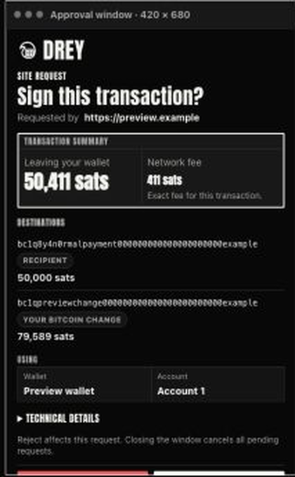

### Implemented ordinary payment approval

This capture uses the corrected production-shaped fixture. The review body scrolls independently, the sat-flow section is present, and both decisions remain visible at the real 420 × 680 window size.

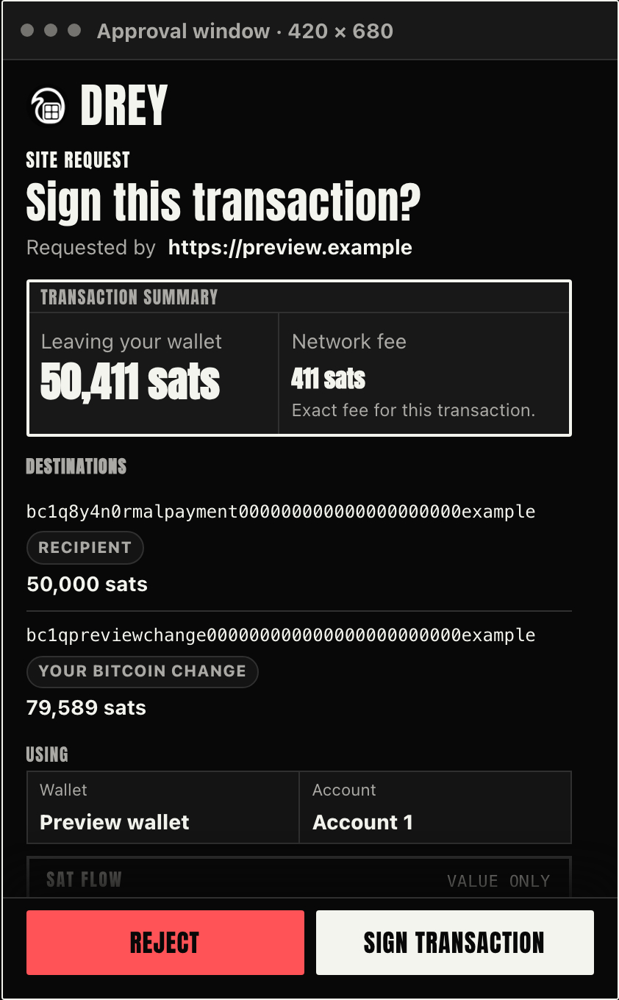

#### Matched before/after

Both sides below use the same transaction data, production sat-flow projection, and 420 × 680 viewport. Before is on the left; after is on the right. The visible change is the persistent decision bar at the bottom while the review body scrolls behind it.

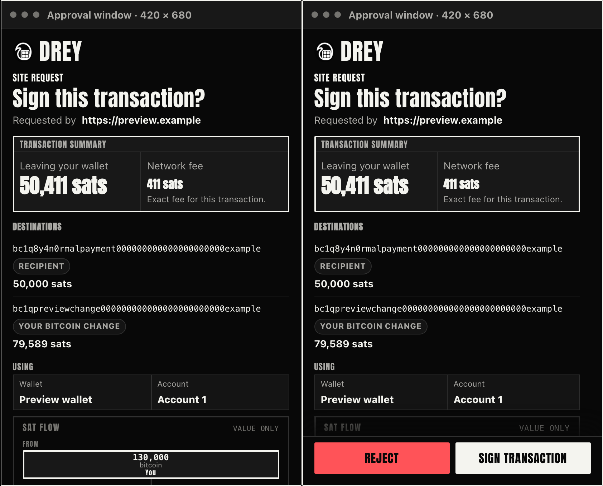

### Implemented marketplace approval

The dense flexible-listing review retains its full explanation while keeping the safe exit and signing action visible. The primary action remains subject to the existing request-specific gates.

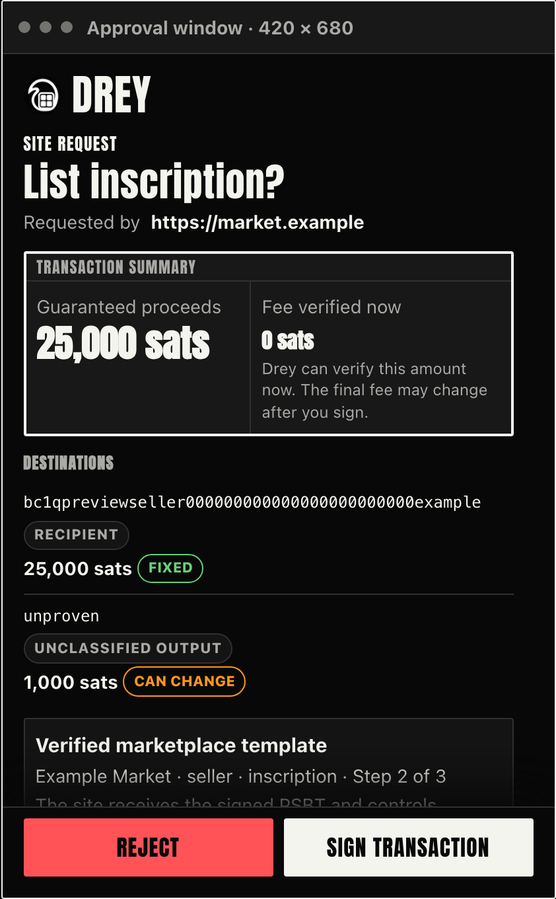

### Current marketplace approval — top and bottom require separate views

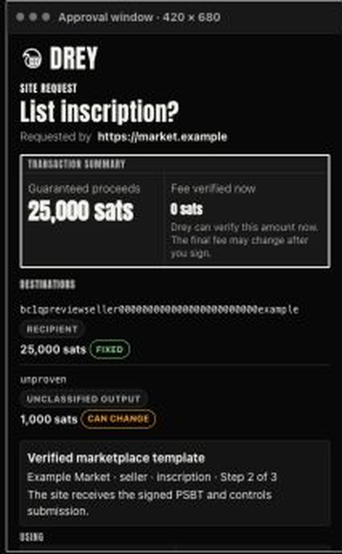

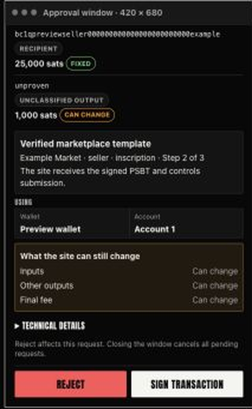

### Approval concept — not implemented

This concept is a possible next polish pass: human-readable grouping, larger details, abbreviated addresses with an inspection affordance, and a persistent action footer. It is directional, not a pixel-perfect specification, and should not be read as a correction of an obsolete “before” design.

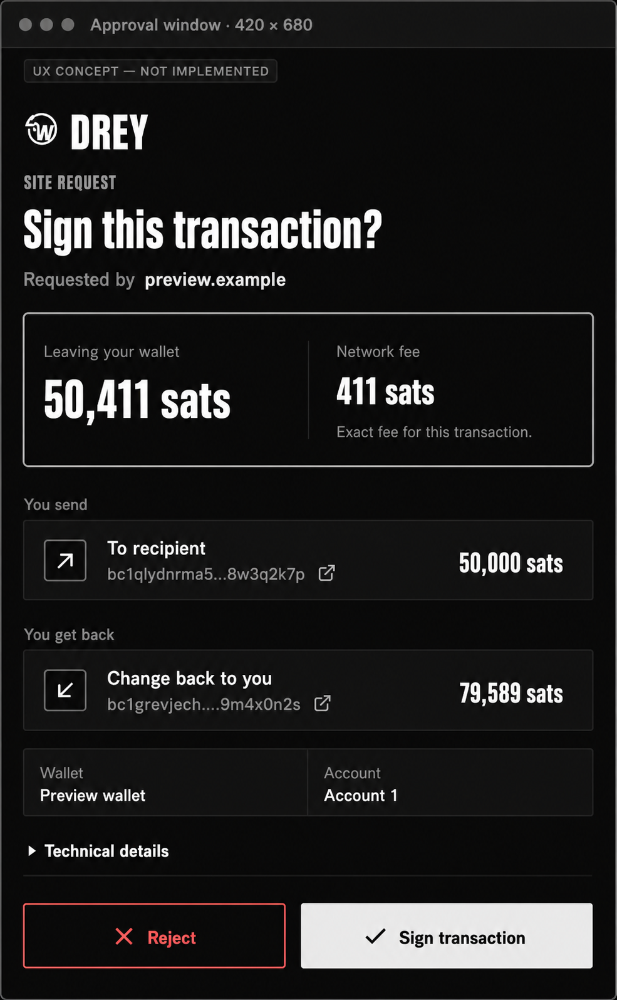

### Current mobile comparison

Mobile received the equivalent approval clarification in commit `48d3edc` on 2026-08-26. It uses the same shared Core explanation, but adapts it to a full-screen native sheet. Its most useful structural difference is that `Reject` and the primary action sit in a fixed footer outside the scrollable review body. This keeps both choices visible while the user scrolls through destinations and flexible-signing details.

The mobile fixture uses different synthetic amounts and friendly destination labels, so it is a layout comparison rather than an exact transaction-data comparison. Mobile also has substantially more screen area than the extension popup. The transferable idea is therefore the fixed decision bar and scrollable body—not mobile's exact spacing or type scale.

#### Standard mobile transaction approval

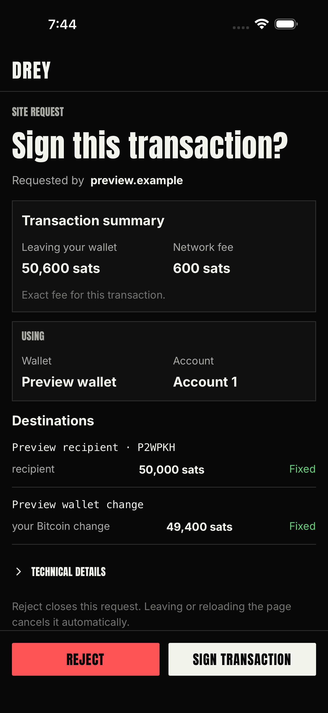

#### Flexible mobile listing approval

The flexible summary continues below the fold, while the decision bar remains visible. This is a clearer compromise than either hiding the actions or forcing the entire explanation above them.

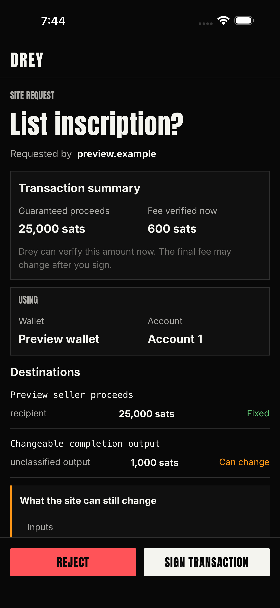

### Recovery Center mobile state

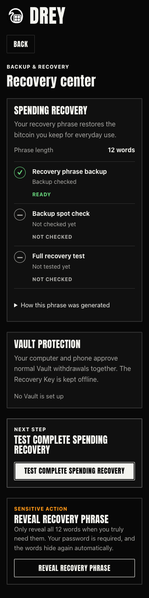

### Recovery Center partial Vault state

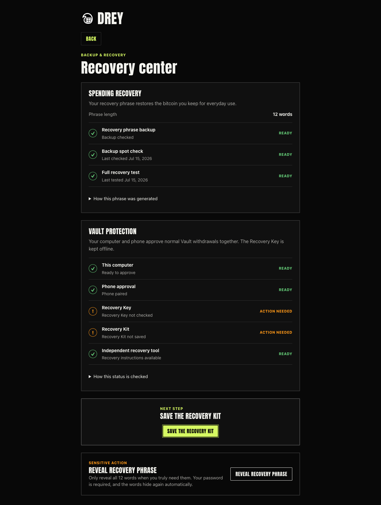

## Research basis

- [Nielsen Norman Group: usability heuristics summary](https://media.nngroup.com/media/articles/attachments/Heuristic_Summary1-compressed.pdf)
- [Nielsen Norman Group: indicators, validations, and notifications](https://www.nngroup.com/articles/indicators-validations-notifications/)
- [Nielsen Norman Group: qualitative usability testing study guide](https://www.nngroup.com/articles/qual-usability-testing-study-guide/)
- [W3C: WCAG 2.2](https://www.w3.org/TR/WCAG22/) — used only as a severe-issue sanity check, not as the review's main lens.
